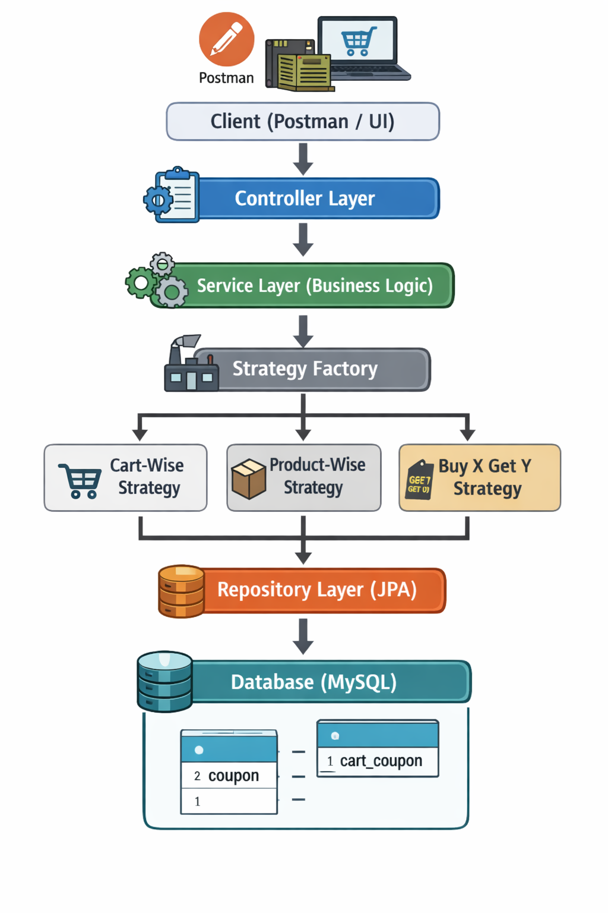

# Monk-Commerce-Coupon-Service

Production-ready Coupon Management API built with **Spring Boot (Java 21)**.

The system supports Cart-Wise, Product-Wise, and Buy-X-Get-Y coupons using a Strategy Pattern based design to handle real-world coupon scenarios with clean architecture and scalable logic.

---

# 🧾 Coupons Management API
### Monk Commerce Backend Assignment

---

## 📌 Overview

This project implements a Coupon Management System capable of creating, managing, and applying multiple coupon types dynamically on a shopping cart.

The solution focuses on:

- Clean layered architecture
- Strategy design pattern
- Normalized database schema
- Concurrency-safe coupon application
- Real-world business rule handling

---

## 🏗️ Architecture Diagram



---

## 🔄 System Flow

Client (Postman / UI)  
↓  
Controller Layer  
↓  
Service Layer (Business Logic)  
↓  
Strategy Factory  
↓  
Coupon Strategy Implementations  
↓  
Repository Layer (JPA)  
↓  
Database Tables

---

## 🧠 Approach

### Strategy Pattern for Coupon Logic

Each coupon type has different validation and discount rules. Instead of using conditional logic in the service layer, the Strategy Pattern is used.

Each coupon type has its own strategy class:

- CartWiseStrategy
- ProductWiseStrategy
- BxGyStrategy

A factory dynamically selects the appropriate strategy based on coupon type.

This ensures:

- Clean separation of concerns
- Easy addition of new coupon types
- No changes required in existing logic

---

### Database Design Approach

A base Coupon table stores common attributes. Each coupon type has a dedicated table for its specific configuration.

This prevents NULL columns and keeps the schema normalized.

---

### Concurrency Handling

Optimistic locking is implemented using a version column to ensure safe updates when multiple requests attempt to apply the same coupon simultaneously.

---

## 🛠️ Tech Stack

Java 21  
Spring Boot  
Spring Data JPA (Hibernate)  
MySQL / H2  
Lombok  
JUnit + Mockito

---

## 🎯 Supported Coupon Types

### Cart-Wise Coupon

Applies discount to entire cart if total exceeds a threshold.

Example:  
Spend ₹100 → Get 10% off

---

### Product-Wise Coupon

Applies discount only to specific products.

Example:  
Product ID 5 → 20% discount

---

### Buy-X-Get-Y Coupon

Provides free items based on purchase quantity.

Example:  
Buy 3 items → Get 1 free

---

## ⭐ Default Business Rules

If not provided during creation:

- Expiry Date → Defaults to 1 month from creation
- Usage Count → Tracked automatically

These defaults are handled using JPA lifecycle callbacks.

---

## 🔐 Concurrency Handling

The system uses Optimistic Locking to prevent:

- Race conditions
- Simultaneous coupon usage conflicts
- Inconsistent coupon state updates

---

## 🗄️ Database Schema

Tables:

coupon → Base coupon details  
cart_coupon → Cart-wise configuration  
product_coupon → Product-wise configuration  
bxgy_coupon → BXGY configuration  
bxgy_buy_product → Buy product mapping  
bxgy_get_product → Get product mapping

---

## 🚀 API Endpoints

### Coupon Management

POST /coupons → Create coupon  
GET /coupons → Get all coupons  
GET /coupons/{id} → Get coupon by ID  
PUT /coupons/{id} → Update coupon  
DELETE /coupons/{id} → Delete coupon

---

### Coupon Application

POST /coupons/applicable-coupons → Fetch applicable coupons  
POST /coupons/apply-coupon/{id} → Apply coupon

---

## 🧪 Example Payloads

### Create Cart-Wise Coupon

```json
{
  "type": "CART_WISE",
  "details": {
    "threshold": 100,
    "discount": 10
  }
}
```

---

### Create Product-Wise Coupon

```json
{
  "type": "PRODUCT_WISE",
  "details": {
    "product_id": 1,
    "discount": 20
  }
}
```

---

### Create BXGY Coupon

```json
{
  "type": "BXGY",
  "details": {
    "buy_products": [
      { "product_id": 1, "quantity": 3 }
    ],
    "get_products": [
      { "product_id": 3, "quantity": 1 }
    ],
    "repetition_limit": 2
  }
}
```

---

## ✅ Implemented Use Cases

- Coupon creation for all types
- Duplicate rule validation
- Discount calculation logic
- Expiry validation
- Applicable coupon filtering
- Concurrency-safe application
- Error handling

---

## ⚠️ Edge Cases Considered

- Empty cart
- Invalid quantities or prices
- Coupon applied to non-eligible product
- Cart below threshold
- Multiple coupon applicability
- Concurrent coupon application

---

## 📌 Assumptions

- Each coupon belongs to a single type
- Only one coupon can be applied at a time
- Product IDs in cart are valid

---

## ❗ Limitations

- No coupon stacking
- No user-specific coupon targeting
- No distributed caching
- Simplified BXGY handling

---

---

## 🔮 Future Enhancements

Coupon stacking support  
Category-based coupons  
User-specific coupons  
Analytics dashboard  
Caching layer

---

## 🛠️ Complete Setup Guide

### Step 1 — Install Prerequisites

Install:

- Java 17+
- Maven
- MySQL Server

Verify installation:

```
java -version
mvn -version
```

---

### Step 2 — Create Database

Login to MySQL:

```
mysql -u root -p
```

Create database:

```sql
CREATE DATABASE coupon_db;
```

---

### Step 3 — Configure Application

Update `application.properties`:

```
spring.datasource.url=jdbc:mysql://localhost:3306/coupon_db
spring.datasource.username=root
spring.datasource.password=yourpassword

spring.jpa.hibernate.ddl-auto=update
```

Tables will be created automatically.

---

### Step 4 — Build and Run

```
mvn clean install
mvn spring-boot:run
```

Server starts at:

```
http://localhost:8080
```

---

## 🧪 Testing APIs via cURL

### Create Coupon Cart wise

```
curl -X POST http://localhost:8080/coupons \
-H "Content-Type: application/json" \
-d '{"type":"CART_WISE","details":{"threshold":100,"discount":10}}'
```

---

### Create Coupon Product wise
```
curl --location 'http://localhost:8080/coupons/create' \
--header 'Content-Type: application/json' \
--data '{
"type": "PRODUCT_WISE",
"details": {
"product_id": 1,
"discount": 20
}
}'
```
---
### Create Coupon BXGY
```
curl --location 'http://localhost:8080/coupons/create' \
--header 'Content-Type: application/json' \
--data '{
  "type": "BXGY",
  "details": {
    "repition_limit": 5
  }
}'
```
---

---
### Get All Coupons

```
curl http://localhost:8080/coupons
```

---

### Get Applicable Coupons

```
curl -X POST http://localhost:8080/coupons/applicable-coupons \
-H "Content-Type: application/json" \
-d '{"cart":{"items":[{"product_id":1,"quantity":3,"price":50}]}}'
```

---

### Apply Coupon

```
curl -X POST http://localhost:8080/coupons/apply-coupon/1 \
-H "Content-Type: application/json" \
-d '{"cart":{"items":[{"product_id":1,"quantity":3,"price":50}]}}'
```

---

## 🧪 Testing Included

- Unit tests using JUnit & Mockito
- Controller tests
- Validation and concurrency tests

---

## 🏁 Conclusion

This implementation provides a scalable and maintainable coupon management system capable of handling real-world discount scenarios efficiently while ensuring data consistency and extensibility.

---lementation delivers a robust, scalable, and production-ready coupon management system capable of handling multiple discount scenarios efficiently while ensuring data consistency and extensibility.